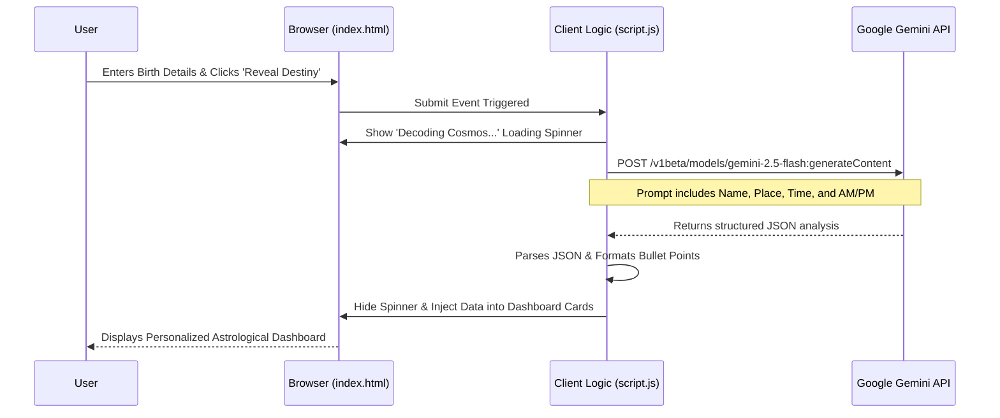

# DestinyAI: Celestial Intelligence Dashboard 🌌

DestinyAI is a visually stunning, front-end web application that merges ancient Vedic astrology with cutting-edge artificial intelligence. By leveraging the power of Google's Gemini AI, DestinyAI provides personalized, mathematically precise astrological forecasts, including life essence summaries, career trajectories, and daily planetary rituals.

## 🚀 Why I Made It
Astrology and cosmic guidance have always fascinated humanity, but traditional birth charts can be dense and difficult to interpret. I built DestinyAI to bridge the gap between ancient wisdom and modern technology. The goal was to create an immersive, premium "Celestial Cinematic" user experience that doesn't just give you a wall of text, but instead decodes your cosmic blueprint into actionable, visually engaging insights.

## 🛠️ Tech Stack
This project is built using a lightweight, lightning-fast stack without the overhead of heavy frameworks:
* **Frontend Structure:** HTML5
* **Styling:** Vanilla CSS3 (Custom Properties, CSS Grid/Flexbox, Glassmorphism, CSS Animations)
* **Logic & Routing:** Vanilla JavaScript (ES6+)
* **Artificial Intelligence:** Google Generative AI (Gemini 2.5 Flash)

## 🏗️ Architecture Diagram

Below is the high-level architecture of how DestinyAI operates purely from the client-side:



## 📂 Project Structure

```text
DestinyAI/
├── index.html       # The main layout, containing all views (Landing, Input, Dashboard, Predictions)
├── style.css        # The "Celestial Cinematic" design system, animations, and responsive grids
├── script.js        # View-switching logic, UI toggles, and the Gemini API fetch implementation
├── config.js        # (Ignored by Git) Contains the Gemini API key
├── .env             # Environment variables (if deployed via a Node server later)
└── .gitignore       # Git ignore rules to protect sensitive keys
```

## 🌍 Real-Life Use Case
DestinyAI is designed for individuals seeking personalized spiritual or astrological guidance without needing to consult a human astrologer. 
* **Daily Alignment:** Users can check the *Predictions* and *Rituals* tabs to see what actions they should take today based on their Rashi (Zodiac sign).
* **Life Planning:** By entering their birth details, users receive a 5-year forecast on career and wealth, helping them make informed decisions during transitional phases of their lives.

## 💻 How to Replicate & Run Locally

To run this project on your local machine, follow these steps:

1. **Clone the Repository:**
   ```bash
   git clone <your-repository-url>
   cd DestinyAI
   ```

2. **Set Up the API Key:**
   Since the application runs purely in the browser, you need to provide your Google Gemini API key. Create a file named `config.js` in the root directory and add the following code:
   ```javascript
   // config.js
   const CONFIG = {
       GEMINI_API_KEY: "YOUR_ACTUAL_API_KEY_HERE"
   };
   ```

3. **Launch the App:**
   Because this is a vanilla HTML/JS app, you don't need to install any npm packages! You can simply open `index.html` in your web browser. 
   
   *Tip: For the best experience, use an extension like **Live Server** in VS Code to run the app on a local port (e.g., `http://127.0.0.1:5500`).*

4. **Experience the Cosmos:**
   Navigate the UI, toggle between Dark and Light mode, and generate your own Kundli to watch the Gemini API in action!
